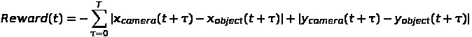
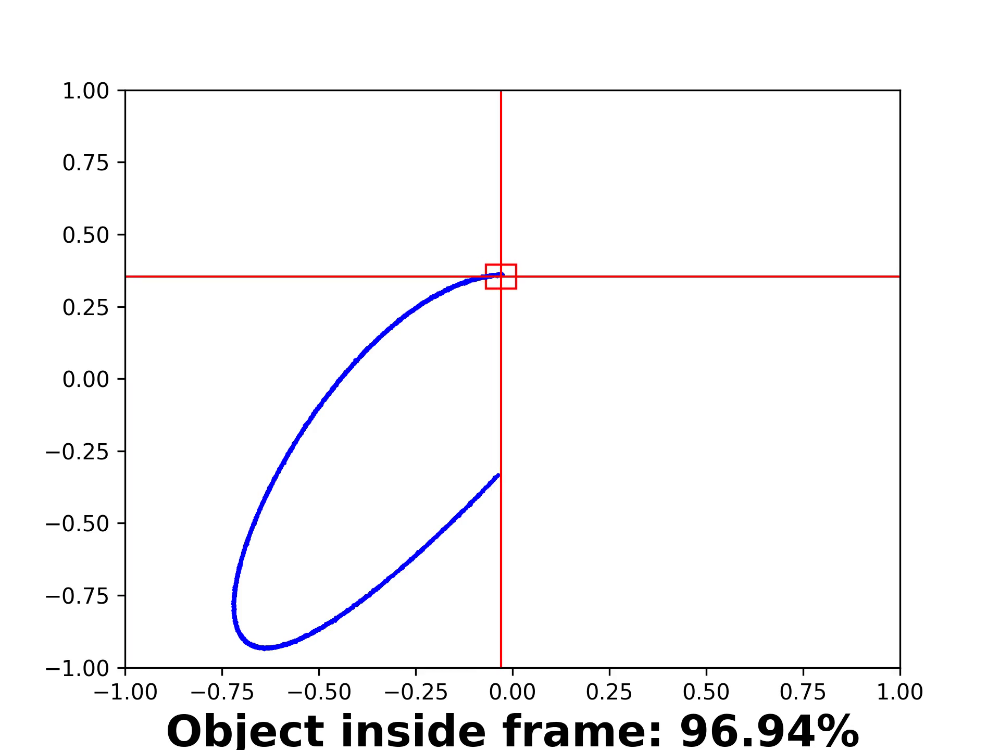

# Tracking-Camera-Environment
Tracking environment for reinforcement learning agents.
The task is to control camera speeds to track object in hard conditions including: 
discretness, PID-controller with weird setting, noisy object position
and fixed chance of random action applied instead of a given action.
Object and camera moving on a square field.
Reward is a sum of manhattan differences between object and camera positions for one simulation step.

**Action size**:  2  <br>
**Observation size**: 8


Observation consist of eight values: two camera normalized coordinates, 
two normalized camera speed values on each axis, 
difference between camera position and object position on each axis, 
difference between camera velocity and object velocity on each axis.
Coordinates are normalized with maximum field sizes.
Speed is normalized with camera maximum speed.
Coordinate difference is calculated between normalized camera coordinates and normalized object coordinates.

Action consist of two speed values in [-1,1] each, 
where 1 corresponds to "full throttle" and -1 is a "full reverse".
Agent pushes action each 50 ticks.
After pushing action camera will be in changing velocity process for next 50 ticks.

### Usage
1. Clone this repository \
```git clone https://github.com/Rufaim/Tracking-Camera-Environment.git```
2. Go to source root directory \
```cd CameraEnvironment/CameraEnvironment```
3. Run train script \
```python3 train_ddpg.py```
4. Run visualization script \
```python3 visualize_results.py```

To change parameters of the model please use global variables of the train script.
For demonstration purpose [DDPG](https://arxiv.org/pdf/1509.02971v2.pdf) model from [my other repository](https://github.com/Rufaim/Pendulum-problem) is used is used.

### Visualization
Results are visualized as AVI video files.
An example of frame from visualization:

Blue curve shows object trajectory.
Red cross tracks camera focal point. 
Red rectangle indicates camera frame size.
Percents in the bottom of a frame provides information about share of frames object is in red rectangle in percents up to the current frame.
In other words, it is a percent of time camera can see the object.
This number is the most representative indicator of quality for a particular agent.
The higher it is the better agent performance.

### Requirements
This environment was tested on

* tensorflow == 2.1
* numpy == 1.18.1
* matplotlib == 3.2.1
